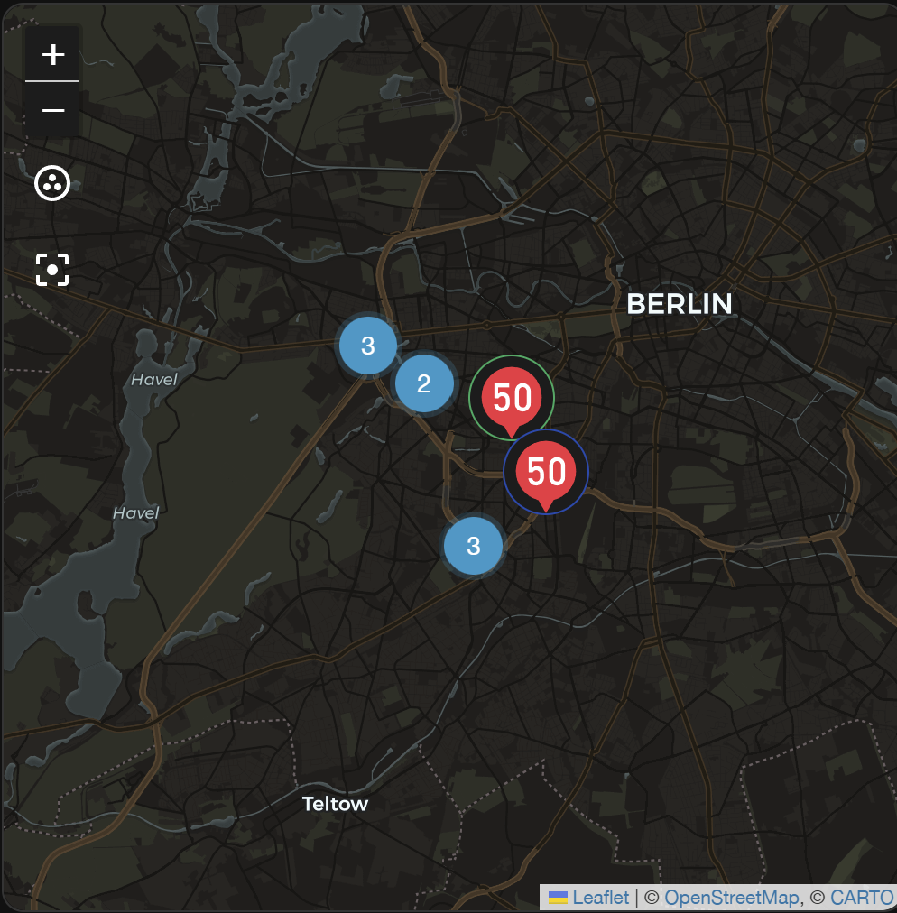
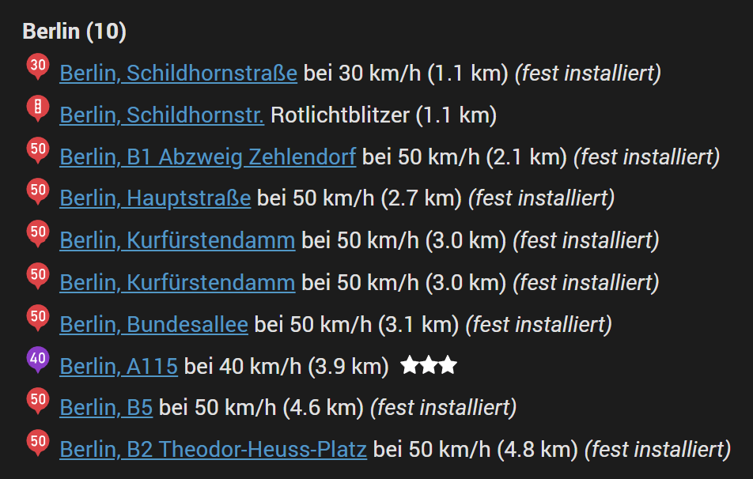

# Blitzer.de Integration for Home Assistant 🏠

[](https://github.com/somansch/blitzer/releases/latest)
[](https://github.com/hacs/integration)
[](LICENSE)

> **Note:** This is a continuation of the original [`hass-blitzerde`](https://github.com/timniklas/hass-blitzerde) integration by [@timniklas](https://github.com/timniklas), whose GitHub account and repository are no longer available. This repository preserves and continues the project so existing users are not left without updates.

## Overview

The Blitzer.de Home Assistant Custom Integration allows you to integrate the Blitzer.de App with your Home Assistant setup.

## Dashboard Examples

Each detected camera is exposed as a `geo_location` entity, with an `area` attribute matching the display name you gave the area in the config flow. This also means they show up natively on the [map card](https://www.home-assistant.io/dashboards/map/).

### Map card



Each configured area gets its **own** `source`, named `blitzer_<area>` (e.g. `blitzer_berlin`, `blitzer_munchen` — the area's display name, lowercased and slugified). This lets you show just one specific area on a map card instead of all of them combined:

```yaml
type: map
geo_location_sources:
  - blitzer_berlin
entities:
  - zone.home
```

Use `geo_location_sources: [all]` (or list every `blitzer_<area>` source) to show all configured areas on the same map.

### Markdown card



The list is sorted by distance to the area's center point, closest first.

```jinja2
<h1></h1>












<b>{{ area }} ({{ sorted_items | count }})</b><br>





<a href="https://map.blitzer.de/v5/ID/{{ state_attr(e, 'backend') }}/">{{ state_attr(e, 'city') }}, {{ state_attr(e, 'street') }}</a>

&nbsp;Rotlichtblitzer ({{ states(e) }} km)

&nbsp;bei {{ state_attr(e, 'vmax') }} km/h ({{ states(e) }} km)


&nbsp;<i>(fest installiert)</i>

&nbsp;&nbsp;







<br>





<div style="text-align:center; opacity:0.7;">
  Aktuell keine Blitzer 🚗💨
</div>

```

## Automations

### Notify when a new camera is reported

Every camera is a `geo_location` entity that gets created the moment it's first reported ([see "Created entities"](#created-entities)), so Home Assistant's built-in [geolocation trigger](https://www.home-assistant.io/docs/automation/trigger/#zone-trigger) already fires whenever a new one shows up inside a zone — no extra code needed. Set the trigger's `source` to the area's `blitzer_<area>` source, `zone` to whatever area you want covered (e.g. `zone.home`, or a custom zone matching the section you configured), and `event` to `enter`:

```yaml
automation:
  - alias: "Neuer Blitzer gemeldet"
    trigger:
      - platform: geolocation
        source: blitzer_berlin
        zone: zone.home
        event: enter
    action:
      - service: notify.mobile_app_dein_handy
        data:
          message: >-
            Neuer Blitzer: {{ state_attr(trigger.entity_id, 'street') }},
            {{ state_attr(trigger.entity_id, 'city') }}
            ({{ state_attr(trigger.entity_id, 'vmax') }} km/h)
```

## Installation

### HACS (recommended)

This integration is available in HACS (Home Assistant Community Store) as a custom repository.

1. Install HACS if you don't have it already
2. Open HACS in Home Assistant
3. Go to any of the sections (integrations, frontend, automation)
4. Click on the 3 dots in the top right corner
5. Select "Custom repositories"
6. Add the following URL to the repository: `https://github.com/somansch/blitzer`
7. Select "Integration" as category
8. Click the "ADD" button
9. Search for "Blitzer.de"
10. Click the "Download" button

### Manual

To install this integration manually, download `blitzer.zip` from the [latest release](https://github.com/somansch/blitzer/releases/latest) and extract its contents to the `config/custom_components/blitzer` directory:

```bash
mkdir -p custom_components/blitzer
cd custom_components/blitzer
wget https://github.com/somansch/blitzer/releases/latest/download/blitzer.zip
unzip blitzer.zip
rm blitzer.zip
```

## Configuration

### Adding an area

From the Home Assistant front page, go to **Settings** and then select **Devices & Services** from the list. Use the **Add Integration** button in the bottom right, search for "Blitzer.de" and add your first area. The integration itself is only added once — to track additional areas (e.g. both "München" and "Berlin"), open the already-added "Blitzer.de" integration card and use its own **Add entry** option to create another entry, one per area, each with its own entities.

After naming the entry, pick a **search mode / Suchart**:

- **Area (radius) / Bereich (Radius)** — the classic mode: one center point plus a radius circle.
- **Route (waypoints) / Route (Wegpunkte)** — search a corridor along a hand-drawn route instead (see below).

#### Area (radius)

| Field | Description |
|---|---|
| **Display name / Anzeigename** | Freely chosen name for this area. Used as a suffix in entity names and IDs (e.g. `sensor.blitzer_blitzer_<name>_total`), and as the `area` attribute on every `geo_location` entity it creates. |
| **Section / Bereich** | Drag the map to the center point you want to monitor and adjust the radius circle. All cameras within this radius are reported. |
| **Types** – Mobile | Include mobile/handheld speed traps. |
| **Types** – Trailer / Anhänger | Include trailer-mounted (semi-stationary) speed traps. |
| **Types** – Fixed / Feste | Include permanently installed fixed speed cameras. |
| **Types** – Red light / Rotlichtampel | Include red light cameras (traffic signal enforcement). |
| **Optional settings / Optionale Einstellungen** – Only show confirmed / Nur bestätigte Blitzer anzeigen | When enabled, only cameras the Blitzer.de community has confirmed recently are reported. |
| **Optional settings / Optionale Einstellungen** – Number of sensors / Maximale Anzahl der Blitzer | Upper limit on how many cameras are tracked at once (default 9). Extra hits beyond this number are ignored. |
| **Optional settings / Optionale Einstellungen** – Whitelist (comma-separated city names) / Whitelist (kommagetrennte Städtenamen) | Comma-separated list of city names to keep, case-insensitive exact match (e.g. `Berlin,Potsdam`). Empty (the default) means no filtering — every city is kept. |
| **Optional settings / Optionale Einstellungen** – Blacklist | Comma-separated list of camera IDs to always exclude, regardless of the whitelist (e.g. `120644,167589`). The ID is the number from the camera's `id`/`backend` attribute, which is also the same number used in its `https://map.blitzer.de/v5/ID/<id>/` URL. Use this for specific cameras you want to ignore (e.g. false positives or ones you're just not interested in), as opposed to the whitelist, which filters by city name. |

#### Route (waypoints)

For a commute or a regular trip, "area" search would need an impractically large radius. Route mode instead lets you draw the route as a chain of waypoints, one map at a time — the same drag-the-map interaction as the area's radius picker, just repeated per point instead of one point plus a circle:

1. Move the map to your route's starting point, then leave **Add another waypoint** checked and continue — one map screen per waypoint.
2. Add a waypoint at every place the route bends noticeably. Cameras are searched in a corridor along the *straight* line between consecutive waypoints, not along actual roads (there's no routing engine involved), so a long straight line across a curve will miss cameras on the curve or search too widely off to the side.
3. Uncheck **Add another waypoint** once you've placed the last one (at least 2 total).
4. Set the **Corridor width (meters) / Korridorbreite (Meter)** — how far to each side of the route line to search (default 300 m) — plus the same camera-type and optional-settings fields as area mode.

Internally, the integration interpolates extra sample points along each straight segment (spaced one corridor-width apart) and queries Blitzer.de around every one of them, then merges and deduplicates the results by camera id.

Editing a route via **Configure** first asks **what to edit**:

- **Edit waypoints** — steps you through every already-saved waypoint one at a time (move the map to reposition it, or check **Remove this waypoint** to drop it), then lets you append further new waypoints to the end. The route isn't discarded and redrawn from scratch.
- **Edit search settings** — jumps straight to corridor width, camera types, and the optional settings, without touching the waypoints at all.

Every field above can be changed afterwards: go to **Settings → Devices & Services**, find the entry for the area you want to change, and click **Configure**. The form opens pre-filled with that area's current settings.

### Created entities

Each area or route produces the following entities:

| Entity | Example ID | Description |
|---|---|---|
| Total count sensor | `sensor.blitzer_blitzer_<name>_total` | Number of currently reported cameras (capped at "Number of sensors"). Its attributes break the count down per city. |
| One `geo_location` entity per camera | `geo_location.blitzer_<name>_<street>` | Created and removed dynamically as cameras appear and disappear from the live data — there's no fixed pool of entities. |

Attributes on each camera's `geo_location` entity:

| Attribute | Description |
|---|---|
| `state` | Distance in km (or miles) to the nearest reference point — the area's center point in area mode, or the nearest of the route's waypoints in route mode. |
| `source` | `blitzer_<area>`, e.g. `blitzer_berlin`. Lets a map card select one specific area via `geo_location_sources`. |
| `area` | The display name you gave this area. |
| `type` | One of `mobile`, `trailer`, `fixed`, or `redlight`. |
| `id` / `backend` | The camera's numeric Blitzer.de ID — the same number used in its `https://map.blitzer.de/v5/ID/<id>/` URL and in the blacklist option. |
| `vmax` | Speed limit at this location, in km/h (or `/` for red light cameras, `?` if unknown). |
| `counter` | Number of community confirmations (always `0` for fixed cameras). |
| `city`, `street`, `zip_code` | Address of the camera. |
| `entity_picture` | Icon URL matching the camera's type and speed. |

## Help and Contribution

If you find a problem, feel free to open an issue and I will do my best to help. If you have something to contribute, your help is greatly appreciated! If you want to add a new feature, please open a pull request first so we can discuss the details.

## Disclaimer

This custom integration is not officially endorsed or supported by Blitzer.de. Use it at your own risk and ensure that you comply with all relevant terms of service and privacy policies.

There is no official, documented Blitzer.de API. This integration queries `cdn2.atudo.net`, the backend used internally by the Blitzer.de map application, the same way a number of other long-standing community projects (for Home Assistant, ioBroker, FHEM, and others) do. It is not a sanctioned integration point.

[Blitzer.de's terms of use](https://www.blitzer.de/en/terms-of-use/) grant only a non-exclusive, non-transferrable license for private use of their apps, and explicitly prohibit reverse-engineering their apps and using their traffic data "in any way without our written consent or license." Using this integration is likely a violation of those terms in the strict sense, even though there's no indication of Blitzer.de having taken action against the existing ecosystem of similar tools. Use it at your own legal risk.
